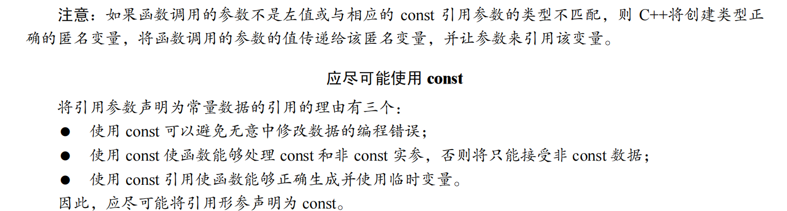

new操作符从自由存储区（free store）上为对象动态分配内存空间，而malloc函数从堆上动态分配内存。自由存储区是C++基于new操作符的一个抽象概念，凡是通过new操作符进行内存申请，该内存即为自由存储区。而堆是操作系统中的术语，是操作系统所维护的一块特殊内存，用于程序的内存动态分配，C语言使用malloc从堆上分配内存，使用free释放已分配的对应内存。

那么自由存储区是否能够是堆（问题等价于new是否能在堆上动态分配内存），这取决于operator new 的实现细节。自由存储区不仅可以是堆，还可以是静态存储区，这都看operator new在哪里为对象分配内存。
