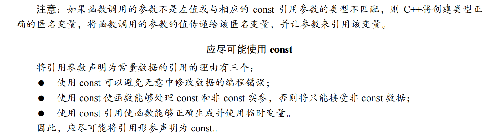

# 在C++中，我们通常将类型分为值类型和引用类型。

## 值类型：
- 值类型的变量直接存储它们的数据。例如，当你声明int a = 10;时，a就是一个值类型的变量，它直接存储了值10。
## 引用类型
- 引用类型：引用类型的变量存储的是其他变量的地址，也就是引用了其他变量。
	例如，int& ref = a;中的ref就是一个引用类型的变量，它引用了变量a。

### 值类型和引用类型的主要区别在于:
	值类型的变量和它们的数据是紧密绑定的，每个变量都有自己的数据副本。而引用类型的变量则是通过引用（也就是别的变量的地址）来访问数据，多个引用类型的变量可以引用同一个数据。

### 在C++中，所有的类型都可以有值语义和引用语义，这取决于你如何使用它们。

	1. 值语义：当你直接声明一个变量时，你就是在使用值语义。例如，int a;或std::vector<int> v;。这些变量存储的是实际的数据（对于v，实际的数据是一个动态数组的元数据）。

	2. 引用语义：当你声明一个指针或引用时，你就是在使用引用语义。例如，int* p;或std::vector<int>& rv;。这些变量存储的是其他变量的地址。
   
> 需要注意的是，C++中的引用和指针都可以用来实现引用语义，但它们的用法有所不同。指针可以被重新指向其他的对象，而引用在初始化后就不能改变。此外，指针可以为空，而引用必须被初始化并且不能为空。

## 在C++中，指针类型和引用类型都是一种复合类型，它们都可以用来间接访问其他对象。

1. 指针类型：指针存储的是另一个对象的内存地址。你可以使用*运算符来访问指针指向的对象。例如：
2. 
```
int a = 10;
int* p = &a; // p是一个指针，存储的是a的地址
*p = 20; // 通过指针p修改a的值
```

2. 引用类型：引用是另一个对象的别名，它提供了对该对象的直接访问。一旦引用被初始化为一个对象，就不能改变为引用其他对象。引用必须在定义时初始化。例如：
```
int a = 10;
int& r = a; // r是a的引用，也就是a的别名
r = 20; // 通过引用r修改a的值
```

## 函数参数的值传递和引用传递

1. 值传递：传递的是参数的副本
2. 引用传递：传递的是参数本身

```cpp
#include <iostream>
int main()
{
	using namespace std;
	int rats = 100;
	int & rodents = rats; // 必须在声明引用变量时进行初始化。而不能像指针那样，先声明，再赋值
	cout << rats << ";" << rodents << endl << "address: " << &rats << ";"<< &rodents << endl;
	int bunnies = 50;
	rodents = bunnies; // 可以通过初始化声明来设置引用，但不能通过赋值来设置。赋值只能改变值，不能重定向引用的地址
	cout << rats << " " << rodents << " " << bunnies << endl;
	cout << &rats << " "<< &rodents << " " << &bunnies << endl;
}

Output:
100;100
address: 0x62fe14;0x62fe14
50 50 50
0x62fe14 0x62fe14 0x62fe10
```

## 临时变量、引用参数和 const
- 如果实参与引用参数不匹配，C++将生成临时变量。当前，仅当参数为 const 引用时，C++才允许这
样做，但以前不是这样。下面来看看何种情况下，C++将生成临时变量，以及为何对 const 引用的限制是
合理的。
1. 首先，什么时候将创建临时变量呢？如果引用参数是 const，则编译器将在下面两种情况下生成临时
变量: 
   1) 实参的类型正确，但不是左值；
   2) 实参的类型不正确，但可以转换为正确的类型。

		左值是什么呢？左值参数是可被引用的数据对象，例如，变量、数组元素、结构成员、引用和解除引
		用的指针都是左值。非左值包括字面常量（用引号括起的字符串除外，它们由其地址表示）和包含多项的
		表达式。在 C 语言中，左值最初指的是可出现在赋值语句左边的实体，但这是引入关键字 const 之前的情
		况。现在，常规变量和 const 变量都可视为左值，因为可通过地址访问它们。但常规变量属于可修改的左
		值，而 const 变量属于不可修改的左值。
简而言之，如果接受引用参数的函数的意图是修改作为参数传递的变量，则创建临时变量将阻止这种
意图的实现。解决方法是，禁止创建临时变量，现在的 C++标准正是这样做的（然而，在默认情况下，有
些编译器仍将发出警告，而不是错误消息，因此如果看到了有关临时变量的警告，请不要忽略）
因此，如果声明将引用指定为 const，
C++将在必要时生成临时变量。实际上，对于形参为 const 引用的 C++函数，如果实参不匹配，则其行为类
似于按值传递，为确保原始数据不被修改，将使用临时变量来存储值


