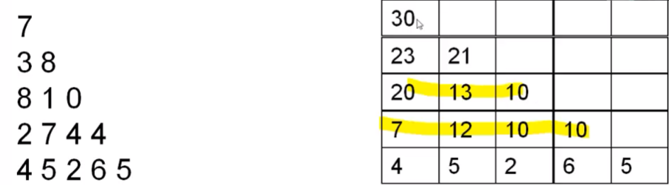
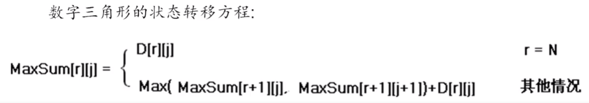

# 数据结构与算法

## PAT

### 数据结构 *--参照408考试的数据结构*

1. 线性表，栈，队列和向量
2. 字符串
3. 树，图，哈希表，并查集

### 算法 *参见中国大学MOOC程序设计与算法（二）算法基础*

#### 常见算法 *算法--解决问题的方法*

1. 枚举 *--基于逐个尝试答案的一种问题求解策略*
2. 分治和递归

   1) 递归：一个函数调用其自身，就是递归
   2) 递归的条件：
      1) 子问题和原问题相同，规模更小
      2) 有递归出口，考虑边界情况
   3) 递归的作用：
      1) 替代多重循环
      2) 解决本来就是用递归形式定义的问题
      3) 将问题分解为规模更小的子问题进行求解
   4) 分治：一种思想：把一个任务，分成形式和原任务相同，但规模更小的几个部分任务(通常是两个部分)，分别完成，或只需要选一部完成。然后再处理完成后的这一个或几个部分的结果，实现整个任务的完成。
   5) 分治和递归的关系：分治的实现常用到递归
3. 二分算法 *--更多指的是二分查找，用来在一些有序数据中可以使用二分算法来解决的问题*
4. 动态规划：动态规划（Dynamic Programming，简称 DP）

   1) 思想：动态规划的核心思想是将一个大的问题分解成多个较小的子问题来解决，多个子问题所得到的结果就是整一个问题的解。动态规划就致力于解决每个子问题一次，***减少重复计算***。
   2) 递归转动态规划：递归函数有n个参数，就定义一个n维的数组，数组的下标是递归函数参数的取值范围，数组元素的值是递归函数的返回值，***这样就可以从边界值开始逐步填充数组***，相当于计算递归函数值的逆过程。
   3) 解题一般思路：
      1) 将原问题分解为子问题
         把原问题分解为若干个子问题，子问题和原问题形式相同或类似，只不过规模变小了。子问题都解决，原问题即解决(数字三角形例)。子问题的解一旦求出就会被保存，所以每个子问题只需求解一次。
      2) 确定状态
         在用动态规划解题时，我们往往将和子问题相关的各个变量的一组取值，称之为一个“状态”。***一个“状态”对应于一个或多个子问题所谓某个“状态”下的值***就是这个“状态”所对应的子问题的解。
      3) 确定一些初始状态(边界状态)的值
         以“数字三角形”为例，初始状态就是底边数字，值就是底边数字值。
      4) 确定状态转移方程
         定义出什么是“状态”，以及在该“状态”下的 “值”后，就要
         找出不同的状态之间如何迁移----即如何从一个或多个“值”已知的“状态”，求出另一个“状态”的“值”(“人从为我”递推型)。状态的迁移可以用递推公式表示，此递推公式也可被称作“状态转移方程”
         --数字三角形递推公式：
         
   4) 特点
      1) 问题具有最优子结构性质。如果问题的最优解所包含的
         子问题的解也是最优的，我们就称该问题具有最优子结
         构性质。
      2) 无后效性。当前的若干个状态值一旦确定，则此后过程
         的演变就只和这若千个状态的值有关，和之前是采取哪.
         种手段或经过哪条路径演变到当前的这若千个状态，没
         有关系。
   5) 动归的常用两种形式
      1) 递归型
         优点:直观，容易编写
         缺点:可能会因递归层数太深导致爆栈，函数调用带来额外时间开销。无法使用滚动数组节省空间。总体来说，比递推型慢。
      2) 递推型
         效率高，有可能使用滚动数组节省空间
5. 搜索算法和减枝
   1) 深度优先搜索：常用递归
   2) 广度优先搜索：需要队列
   3) 减枝
      1) 含义：剪枝是一种可以提高搜索算法时间和空间效率的技术。通过剪枝，我们可以在搜索过程中排除一些不可能产生最优解的选项，从而减少搜索的复杂性。例如，在深度优先搜索或广度优先搜索中，如果我们已经知道当前路径的长度超过了已知的最短路径，那么我们就可以停止在这条路径上的搜索，这就是一种剪枝策略。

6. 贪心算法

#### 常见机试题目 *--参见机试指南*

1. 需要打印路径或字符串又用到递归的，要把前面的当参数传递。见搜索中的"图中寻找路径.py"和递归中的"全排列.py"
